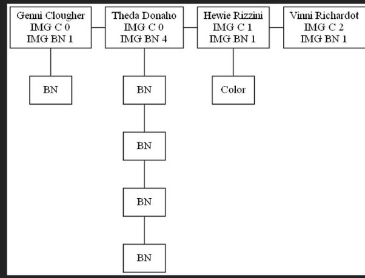

# EDD_UDRAWING_FASE_201903909

# SIMULACION DE SISTEMA DE IMPRESIÓN DE IMÁGENES

Al iniciar la aplicación se mostraran las siguientes opciones:

A continuación se describen las acciones de cada una de las funciones:
____

**Parámetros Iniciales**

Esta opción permite la carga masiva de clientes al sistema y también permite ingresar el número de ventanillas en el sistema.

Nota: Para la carga masiva se debe de cargar un archivo tipo json.

___
**Ejecutar Paso**

Esta opción simula el algoritmo de entrada y salida de las ventanillas y la impresión de imágenes.

____
**Estado en memoria de las estructuras**

Esta opción genera el estado en memoria de las estructuras en formato png.

Cola de espera

Lista ventanillas

Cola de impresoras

Clientes en espera

Clientes Atendidos

___
**Reportes**

Permite generar los siguiente reportes:

1. Top 5 de clientes con mayor cantidad de imágenes a color.
1. Top 5 de clientes con menor cantidad de imágenes en blanco y negro.
1. Información del cliente que más pasos estuvo en el sistema.
1. Datos de un cliente en específico.

___
**Mostrar datos del estudiante**

____
**Salir**

Cierra la aplicación.
